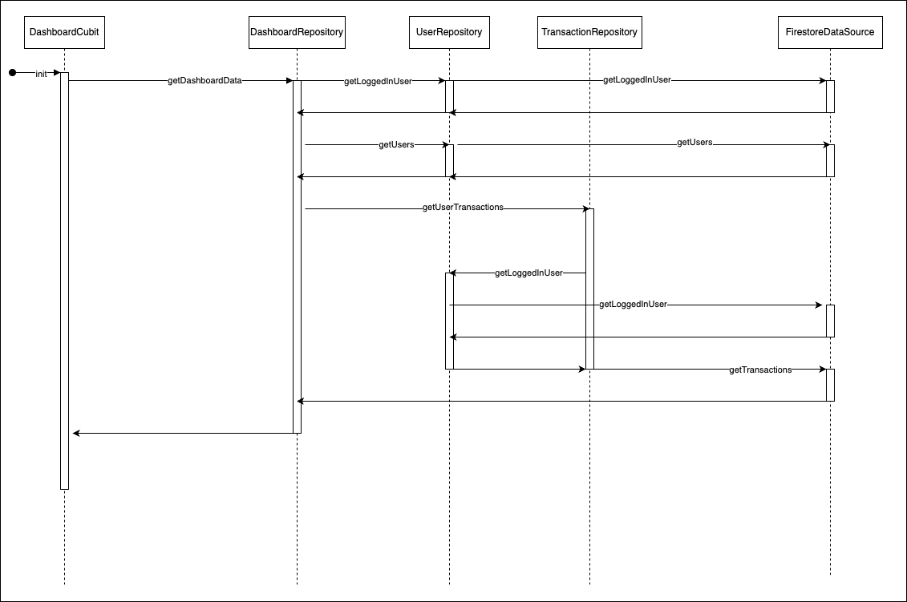

# Mamo

## Get started

### Install Flutter
Make sure that you have proper Flutter version installed, check pubspec.yaml for currently used version in the project.

### Generate files
Run the following command to generate files:

```bash
dart run build_runner build --delete-conflicting-outputs
```

## Architecture overview

### System diagram


### Example data flow with Firestore based on DashboardRepository



## External dependencies

- **go_router** for navigation
- **flutter_bloc** for state management
- **flutter_svg** for displaying SVGs
- **firebase_core** for Firebase initialization
- **cloud_firestore** for Firestore database

## Additional info

- Project tries to follow Clean Architecture principles
- I decided to create my own App Container for object initialization
- For data flow I've used Result class located in domain/base directory

